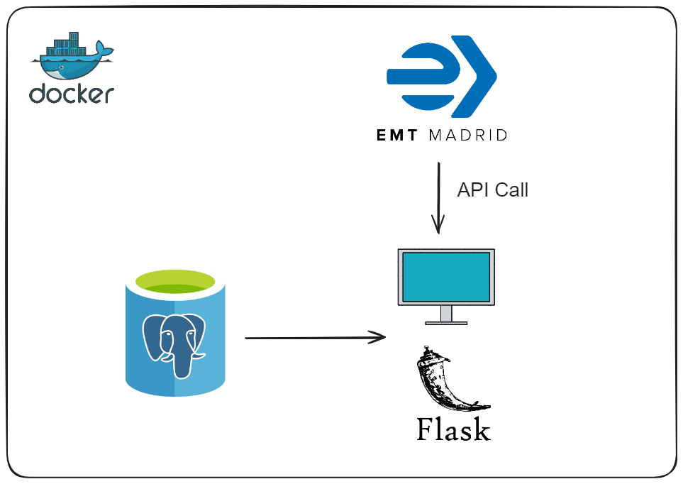

[](LICENSE)

# Autobuses EMT App

Bienvenido a mi aplicación de autobuses de la EMT, una plataforma interactiva diseñada para poder registrar los autobuses recorridos, paradas favoritas y obtener datos en tiempo real.

## Tabla de Contenidos
- [Funcionalidades Principales](#funcionalidades-principales)
- [Diagrama del proyecto](#diagrama-del-proyecto)
- [Instrucciones de Uso](#instrucciones-de-uso)
  - [Prerequisitos](#prerequisitos)
  - [Instalación](#instalación)
  - [Tests](#tests)
- [Tecnologías Utilizadas](#tecnologias-utilizadas)
- [Licencia](#licencia)
- [Contacto](#contacto)

## Funcionalidades Principales

- **Visualizar lineas recorridas:** Permite visualizar las diferentes lineas de autobus que has recorrido.

- **Agregar linea recorrida:** Permite agregar las lineas de autobus que has recorrido para tener un seguimiento de ellas.

- **Detalle linea recorrida:** Permite ver de manera detallada la linea recorrida con las paradas que tiene y su recorrido geoposicionado en un mapa.

- **Visualizar paradas favoritas:** Permite visualizar las diferentes paradas favoritas que has agregado a favoritos. Puedes eliminarlas de favoritos si lo deseas.

- **Agregar parada favorita:** Permite agregar las paradas favoritas dentro de las lineas de autobus que has recorrido.

- **Detalle parada favorita:** Permite ver en detalle los datos de la parada favorita y el tiempo de espero de las lineas de esa parada en vivo.

- **Llevame:** Permite calcular la mejor ruta en vivo entre una parada origen para llegar a una parada destino. Muestra los pasos detalladamente que se deben seguir para llegar al destino.

## Diagrama del proyecto



## Instrucciones de Uso

### Prerequisitos

Antes de comenzar, asegúrate de tener instalado Docker en tu máquina. Puedes descargarlo [aquí](https://www.docker.com/get-started).

### Instalación

Para ejecutar la aplicación con Docker:

1. Clona este repositorio con el siguiente comando:

    ```bash
    git clone https://github.com/nachodorado98/Flask-Autobuses.git
    ```

2. Navega al directorio del proyecto.

3. Ejecuta el siguiente comando para construir y levantar los contenedores:

    ```bash
    docker-compose up -d
    ```

4. Accede a la aplicación desde tu navegador web: `http://localhost:5000`.

### Tests

Para ejecutar los tests de la aplicación:

1. Asegúrate de que los contenedores estén en funcionamiento. Si aún no has iniciado los contenedores, utiliza el siguiente comando:

    ```bash
    docker-compose up -d
    ```

2. Dentro del contenedor de la aplicacion, cambia al directorio de los tests:

    ```bash
    cd tests
    ```

3. Ejecuta el siguiente comando para ejecutar los tests utilizando pytest:

    ```bash
    pytest
    ```

Este comando ejecutará todas las pruebas en el directorio `tests` y mostrará los resultados en la consola.


## Tecnologías Utilizadas

- [](https://www.python.org/)
- [](https://flask.palletsprojects.com/)
- [](https://www.postgresql.org/)
- [](https://developer.mozilla.org/en-US/docs/Web/HTML)
- [](https://developer.mozilla.org/en-US/docs/Web/CSS)
- [](https://developer.mozilla.org/en-US/docs/Web/JavaScript)
- [](https://www.docker.com/)
## Licencia

Este proyecto está bajo la licencia MIT. Para mas informacion ver `LICENSE.txt`.
## 🔗 Contacto
[](https://github.com/nachodorado98/Flask-Partidos)

[](mailto:natxo98@gmail.com)

[](https://www.linkedin.com/in/nacho-dorado-ruiz-339209237/)
